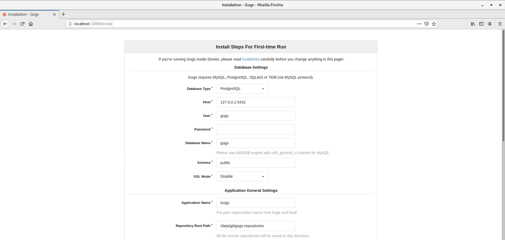
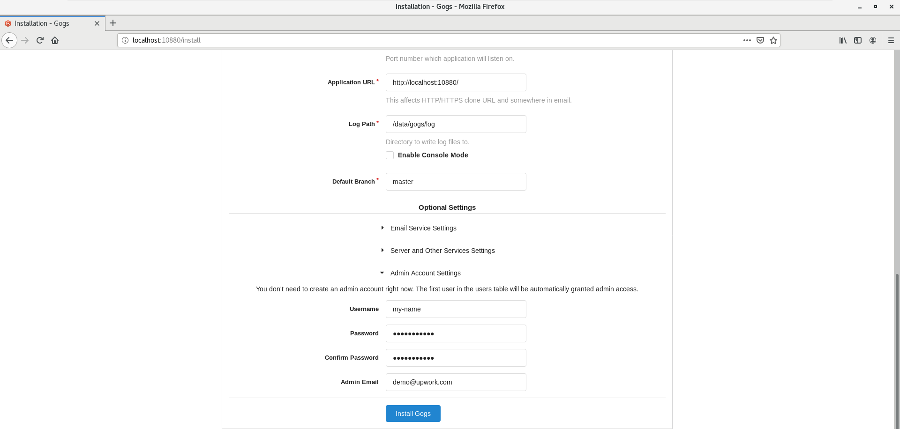
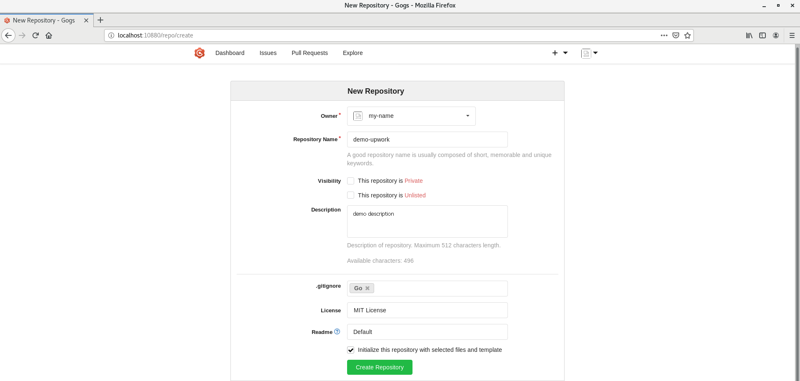
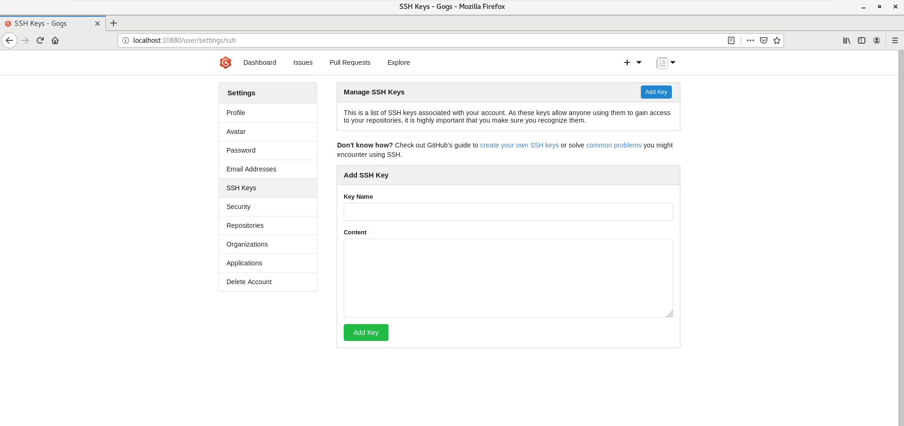
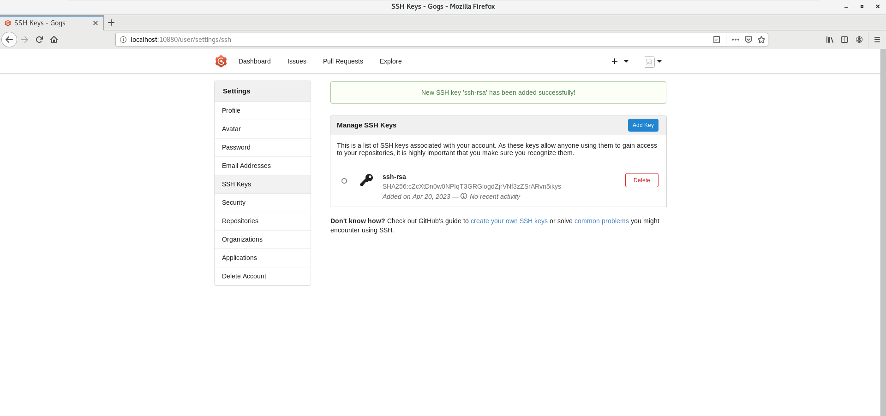
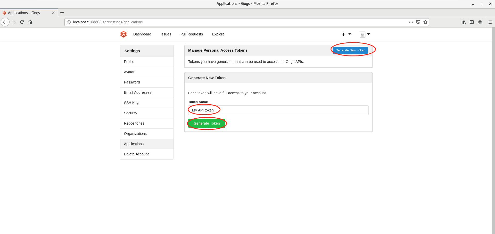

# kcg-devops-gogs-mirror

## Document steps

## 1. Run gogs.

- https://github.com/gogs/gogs
- https://gogs.io/docs/installation/install_from_source.html

## 2. Gogs may be run locally on any system with golang, or could be run in a docker container.

- like git pull, git clone of gogs

### Docker for Gogs

To keep your data out of Docker container, we do a volume ($HOME/gogs -> /data) here, and you can change it based on your situation.

```shell
# Pull image from Docker Hub.
$ docker pull gogs/gogs

# Create local directory for volume.
$ mkdir -p $HOME/gogs

# Use `docker run` for the first time.
$ docker run -d --name=gogs -p 10022:22 -p 10880:3000 -v $HOME/gogs:/data gogs/gogs

# Use `docker start` if you have stopped it.
$ docker start gogs
```

Note: It is important to map the SSH service from the container to the host and set the appropriate SSH Port and URI settings when setting up Gogs for the first time. To access and clone Git repositories with the above configuration you would use: `git clone ssh://git@hostname:10022/username/myrepo.git` for example.

In our example we have to type the following address into the browser:
`http://localhost:10880/install`

As a result you should see the setup page of Gogs:


In this setup page we need to adapt the default settings to the settings we defined in the docker run command we executed previously. Thus, please change the input fields according to this table:

| Input field     | Description                                                      |
| --------------- | ---------------------------------------------------------------- |
| Database Type   | Replace PostgresSQL with SQLite3                                 |
| SSH Port        | Replace 22 with 10022                                            |
| HTTP Port       | Replace 3000 with 10880                                          |
| Application URL | Replace http://localhost:3000/ with http://localhost:10880/      |
| Log Path        | Replace /app/gogs/log with /data/gogs/log                        |
| Username        | Set an your username e.g. my-name                                |
| Password        | Set an your password with at least 8 characters e.g. my-Passw0rd |
| E-mail          | Set your email address e.g. demo@upwork.com                      |

After you filled all required fields, it should look like this:


To finish the setup, click on **Install Gogs** at the bottom of the page.

After installing in you should see the start page of the Gogs service.


Nice, you successfully installed Gogs! Now let’s start using it! Please continue with the next section to learn how.

### How to create a Git repository in Gogs

Before we will be able to git push, we need to

- create a Git repository in Gogs
- configure your public SSH key in Gogs
- clone the Git repository in Gogs to your local workstation

Let’s start by creating a new repository. Click on the **blue button** in the top right corner of the page and choose **New Repository**.


You should see a setup page for your new repository. Please fill out the two text input fields.

At the bottom of the page you will find a checkbox. We recommend to enable this checkbox since it automatically will initialize this repository with a README.md. The following screenshot shows an example of how the setup page might look like after you provided all the necessary information.


Finish the setup by clicking on **Create Repository**.

Before you can actually use the new repository, you need to add your SSH key. Click on The settings button in the top right corner of the page. Then, go to **SSH Keys -> Add Key**.



Paste your public SSH key into this `Content` field and set an arbitrary `Key Name`, e.g. ssh-rsa.

If you don’t know where to find your SSH key, execute the following command in your terminal.

```shell
cat ~/.ssh/id_rsa.pub
```

As you can see in the following screenshot, you should see your SSH key as result.


Finally, back in the Gogs website, click the green button **Add Key** to add your public SSH key. Afterwards you should see a message confirming that the key has been added successfully.



At this point, Gogs should be set up properly to receive your first commit! As a last step, we will `git clone` the new repo to your workstation.

### Start using Git with the new repository

Gogs helps us in constructing the proper `git clone` command. Navigate inside your new repository in the Gogs Web-GUI and click on **SSH**. Make sure that the SSH button in front of the command is activated and copy the string in the text field via the **Copy** button on the right edge.


Now open a terminal at your workstation and navigate to the location where you want to create the folder for the repository.

Paste the command you just copied from Gogs Web-GUI. Before executing add git clone ssh:// in front of the command and put port 10022 in front of your user name. In our case 10022 is the port Gogs listens on for SSH.

In the end the command should look similar to this one:

```shell
git clone ssh://git@localhost:10022/my-name/demo-upwork.git
```

After this command has been executed confirm the fingerprint prompt and navigate into the new directory that has been created by this command.

Within the repository folder execute a `git pull`. If the command returns Already up-to-date the repository is properly set up.


## - how to set PAM/token

### Create github token

https://github.blog/2013-05-16-personal-api-tokens/

### Create gogs token

To obtain an API token for Gogs, you need to follow these steps:

1. Log in to your Gogs account.

2. Click on your avatar in the upper right corner of the webpage and then click **Your Settings**.

3. In the settings page, select **Applications** from the sidebar.
   

4. In the "Manage Personal Access Tokens" section, and click on **Generate New Token**.

5. Provide a descriptive "Token Name" for the token (for example, "My API token") and click **Generate Token**.
   

6. Gogs will generate a new API token for you. Be sure to copy the token to a safe place, as you won't be able to see it again. If you lose the token, you'll need to generate a new one.

You can now use this API token to authenticate your requests to the Gogs API. Remember to include the token in the "Authorization" header of your HTTP requests, like this:

## - how to run script
